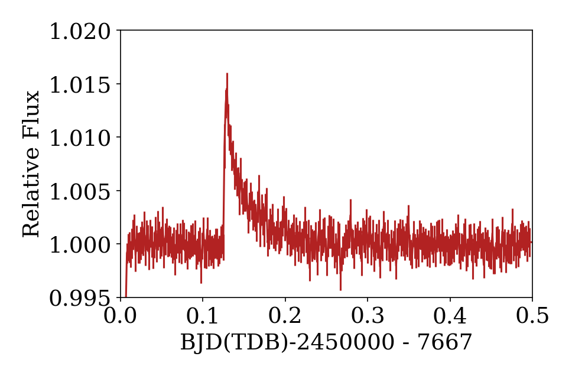

It was pointed out to me that a few "flares" are observable in the Spitzer light curve of Trappist-1

Neat!

My back-of-the envelope analysis is that these events *would* be visible based on the available K2 data, and occuring a few times within the duration of the Spitzer data.

Here I just made some plots of the IR data... 
